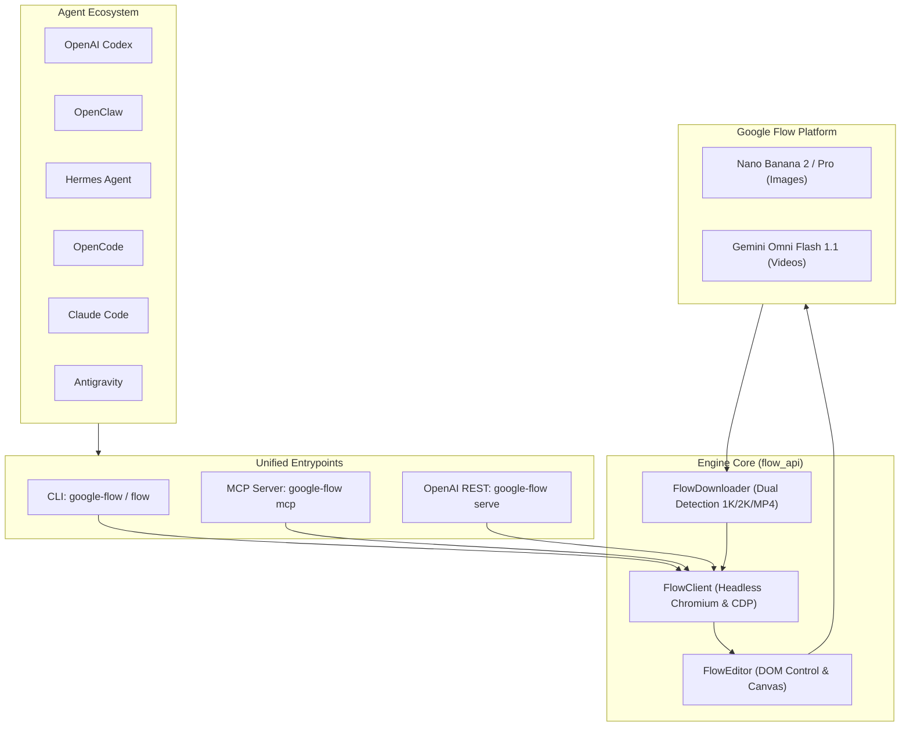

# Universal Agent Guidelines: google-flow-api

This file provides architectural context, commands, and design principles for autonomous AI agents (including OpenAI Codex, OpenClaw, Hermes Agent, OpenCode, Devin, Amp, and Antigravity).

---

## Mission & Design Philosophy

`google-flow-api` transforms Google Flow into an agent-friendly, deterministic media generation engine.

Autonomous agents should not interact with Google Flow through fragile, slow DOM clicking. Instead, agents invoke the unified `google-flow` CLI or MCP server to offload heavy rendering tasks with zero token waste.

---

## Architectural Map



---

## Module Breakdown

| Module | Primary Responsibility |
| :--- | :--- |
| `flow_api.client` | Manages persistent Chromium daemon, CDP connections, tab locks (`__flow_busy__`), and session caching. |
| `flow_api.editor` | Handles prompt submission, model selection, reference image uploading, and completion polling. |
| `flow_api.downloader` | Dual-detection high-resolution extractor (canvas base64 extraction + network blob interception). |
| `flow_api.cli` | Terminal interface with standardized JSON output envelopes on `stdout`. |
| `flow_api.mcp_server` | Model Context Protocol server exposing `generate_image`, `generate_video`, and `check_status`. |
| `flow_api.server` | FastAPI microservice implementing OpenAI's `/v1/images/generations` schema. |

---

## CLI Integration Contract

Autonomous agents should execute commands via subprocess and parse `stdout` as JSON.

### 1. Preflight Authentication Check
Always verify session readiness before starting generative workflows:
```bash
uv run google-flow auth-check --json
```
**Response Envelope**:
```json
{
  "authenticated": true,
  "status": "ready",
  "url": "https://flow.google.com/project/01caca8b-...",
  "session": "default",
  "profile_dir": "C:\\Users\\...\\.google-flow\\chrome_profile"
}
```
- Exit code `0`: Session is authenticated and canvas is ready.
- Exit code `1`: Authentication required. Prompt the user to run `google-flow login`.

### 2. Text-to-Image / Image-to-Image Generation
```bash
uv run google-flow generate \
  --prompt "Hyper-realistic editorial portrait of a cybernetic feline" \
  --model "Nano Banana 2" \
  --ratio "16:9" \
  --resolution "1K" \
  --output-dir "./output"
```
**Response Envelope**:
```json
{
  "success": true,
  "session": "default",
  "model": "Nano Banana 2",
  "ratio": "16:9",
  "reference": null,
  "downloaded_file": "./output/flow_image_1740000000.jpeg",
  "output_dir": "./output"
}
```

### 3. Video Generation (Text-to-Video & Image-to-Video)
```bash
uv run google-flow video \
  --prompt "Cinematic drone shot slowly orbiting a mountain peak at dusk" \
  --duration 6 \
  --ratio "16:9" \
  --resolution "720p" \
  --output-dir "./output"
```

### 4. Concurrency & Multi-Agent Isolation
When multiple agents or parallel tasks execute concurrently, pass `--session <id>` to isolate browser profiles, lock files, and cached projects:
```bash
uv run google-flow generate --prompt "..." --session agent_alpha
```

---

## Development & Test Gates

1. Run tests before submitting changes:
   ```bash
   uv run pytest
   ```
2. Keep all automation runs headless.
3. Preserve cross-platform compatibility across Windows and POSIX.
